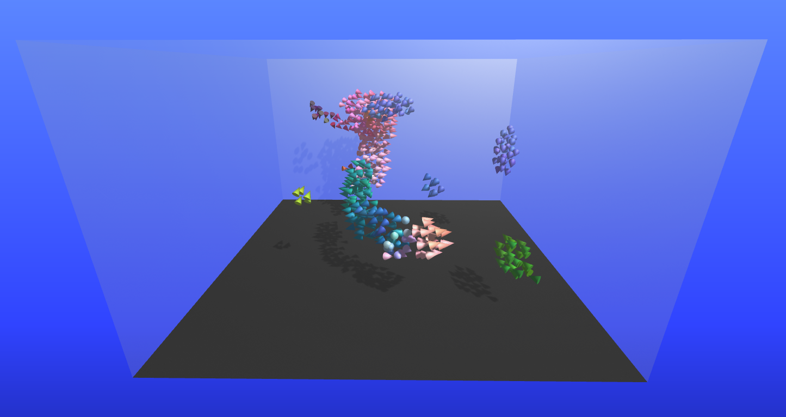

# WebGPU-3D-Boids

3D boids using WebGPU.

## References:

-   [Compute Boids](https://webgpu.github.io/webgpu-samples/samples/computeBoids)
-   [Coding Adventure: Boids](https://www.youtube.com/watch?v=bqtqltqcQhw)
